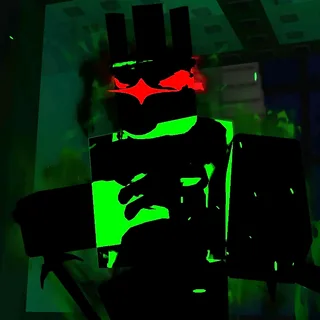

<!DOCTYPE html>
<html lang="en">
<head>
    <link rel="stylesheet" href="style.css">
    <meta charset="UTF-8">
    <meta name="viewport" content="width=device-width, initial-scale=1.0">
</head>
<body>
    <h1>1x1x1x1</h1>
    
1x1x1x1 - Зелёное злое существо с красным светящимся глазом  и мечом

    
Он стреляет сквозь стены и видет

    
Его создатель Шедлетский. Нужен сайт про Шедлетского?

    
</body>
</html>
